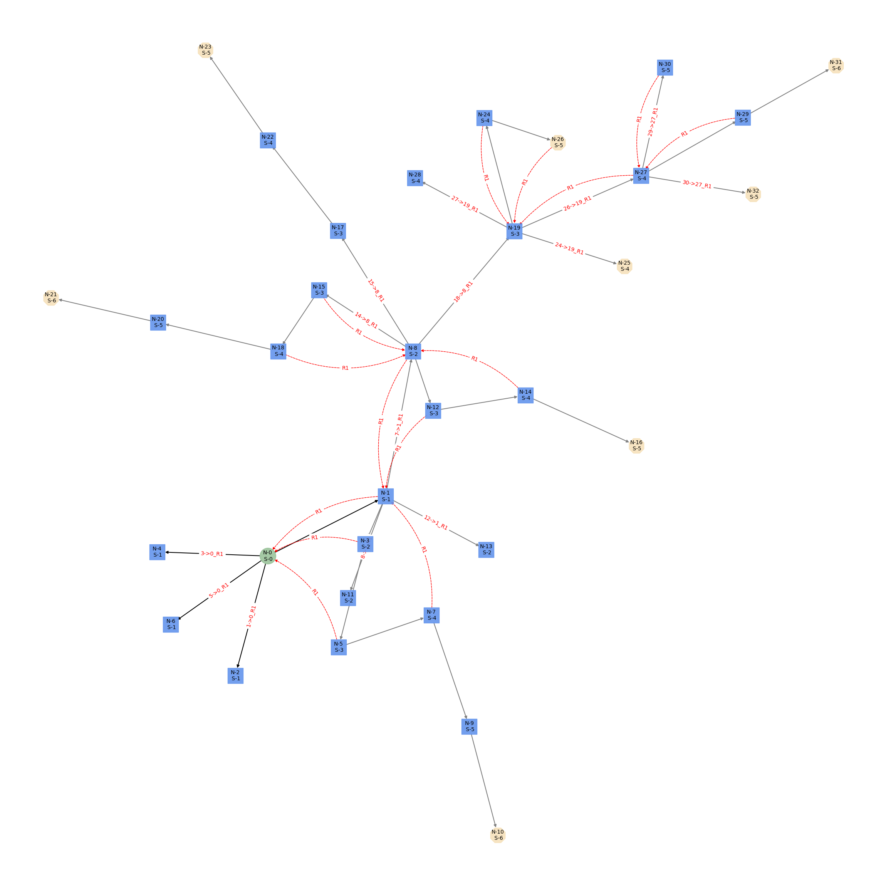

# Overview
After installing the `llmpebase` package, you can run our Thought Rollback with different LLMs under different datasets.

Here are some examples:

#### GSM8K
```console
python examples/ChainOfThought/ChainOfThought.py -c configs/GSM8K/GPT4/Fewshot.yml -b LLMPE
python examples/ChainOfThought/ChainOfThought.py -c configs/GSM8K/GPT4/CoT.yml -b LLMPE
python examples/ChainOfThought/ChainOfThought.py -c configs/GSM8K/GPT4/ZeroshotCoT.yml -b LLMPE

python examples/ChainReasoning/ChainReasoning.py -c configs/GSM8K/GPT4/ChainReasoning_ZeroshotCoT.yml -b LLMPE
python examples/TreeReasoning/TreeReasoning.py -c configs/GSM8K/GPT4/TreeLWGReasoning_ZeroshotCoT.yml -b LLMPE
python examples/ThoughtRollback/ThoughtRollback.py -c configs/GSM8K/GPT4/TRReasoning_ZeroshotCoT.yml -b LLMPE
```


#### SVAMP
```console
python examples/ChainOfThought/ChainOfThought.py -c configs/SVAMP/GPT4/Fewshot.yml -b LLMPE
python examples/ChainOfThought/ChainOfThought.py -c configs/SVAMP/GPT4/CoT.yml -b LLMPE
python examples/ChainOfThought/ChainOfThought.py -c configs/SVAMP/GPT4/ZeroshotCoT.yml -b LLMPE

python examples/ChainReasoning/ChainReasoning.py -c configs/SVAMP/GPT4/ChainReasoning_ZeroshotCoT.yml -b LLMPE
python examples/TreeReasoning/TreeReasoning.py -c configs/SVAMP/GPT4/TreeLWGReasoning_ZeroshotCoT.yml -b LLMPE
python examples/ThoughtRollback/ThoughtRollback.py -c configs/SVAMP/GPT4/TRReasoning_ZeroshotCoT.yml -b LLMPE
```

#### AQUA
```console
python examples/ChainOfThought/ChainOfThought.py -c configs/AQUA/GPT4/Fewshot.yml -b LLMPE
python examples/ChainOfThought/ChainOfThought.py -c configs/AQUA/GPT4/CoT.yml -b LLMPE
python examples/ChainOfThought/ChainOfThought.py -c configs/AQUA/GPT4/ZeroshotCoT.yml -b LLMPE

python examples/ChainReasoning/ChainReasoning.py -c configs/AQUA/GPT4/ChainReasoning_ZeroshotCoT.yml -b LLMPE
python examples/TreeReasoning/TreeReasoning.py -c configs/AQUA/GPT4/TreeLWGReasoning_ZeroshotCoT.yml -b LLMPE
python examples/ThoughtRollback/ThoughtRollback.py -c configs/AQUA/GPT4/TRReasoning_ZeroshotCoT.yml -b LLMPE
```

	


#### MATH
GPT-3.5-turbo:
```console
python examples/ChainOfThought/ChainOfThought.py -c configs/MATH/Fewshot.yml -b LLMPE
python examples/ChainOfThought/ChainOfThought.py -c configs/MATH/CoT.yml -b LLMPE
python examples/ChainOfThought/ChainOfThought.py -c configs/MATH/ZeroshotCoT.yml -b LLMPE
python examples/ChainOfThought/ChainOfThought.py -c configs/MATH/Zeroshot.yml -b LLMPE
```

GPT-4:

```console
python examples/ChainOfThought/ChainOfThought.py -c configs/MATH/GPT4/Fewshot.yml -b LLMPE
python examples/ChainOfThought/ChainOfThought.py -c configs/MATH/GPT4/CoT.yml -b LLMPE
python examples/ChainOfThought/ChainOfThought.py -c configs/MATH/GPT4/ZeroshotCoT.yml -b LLMPE
python examples/ChainOfThought/ChainOfThought.py -c configs/MATH/GPT4/Zeroshot.yml -b LLMPE

python examples/ChainReasoning/ChainReasoning.py -c configs/MATH/GPT4/ChainReasoning_ZeroshotCoT.yml -b LLMPE
python examples/TreeReasoning/TreeReasoning.py -c configs/MATH/GPT4/TreeLWGReasoning_ZeroshotCoT.yml -b LLMPE
python examples/ThoughtRollback/ThoughtRollback.py -c configs/MATH/GPT4/TRReasoning_ZeroshotCoT.yml -b LLMPE

```

#### MMLU

```console
python examples/ChainOfThought/ChainOfThought.py -c configs/MMLU/GPT4/Fewshot.yml -b LLMPE
python examples/ChainOfThought/ChainOfThought.py -c configs/MMLU/GPT4/ZeroshotCoT.yml -b LLMPE

python examples/ChainReasoning/ChainReasoning.py -c configs/MMLU/GPT4/ChainReasoning_ZeroshotCoT.yml -b LLMPE
python examples/TreeReasoning/TreeReasoning.py -c configs/MMLU/GPT4/TreeLWGReasoning_ZeroshotCoT.yml -b LLMPE
python examples/ThoughtRollback/ThoughtRollback.py -c configs/MMLU/GPT4/TRReasoning_ZeroshotCoT.yml -b LLMPE

```

#### TheoremQA

```console
python examples/ChainOfThought/ChainOfThought.py -c configs/TheoremQA/GPT4/Fewshot.yml -b LLMPE
python examples/ChainOfThought/ChainOfThought.py -c configs/TheoremQA/GPT4/CoT.yml -b LLMPE
python examples/ChainOfThought/ChainOfThought.py -c configs/TheoremQA/GPT4/ZeroshotCoT.yml -b LLMPE

python examples/ChainReasoning/ChainReasoning.py -c configs/TheoremQA/GPT4/ChainReasoning_ZeroshotCoT.yml -b LLMPE
python examples/TreeReasoning/TreeReasoning.py -c configs/TheoremQA/GPT4/TreeLWGReasoning_ZeroshotCoT.yml -b LLMPE
python examples/ThoughtRollback/ThoughtRollback.py -c configs/TheoremQA/GPT4/TRReasoning_ZeroshotCoT.yml -b LLMPE
```

# Visualization

We present a complete reasoning process performed by the TR reasoning on a question from the MATH dataset. 

Input:

```
Answer the question about the problem Counting & Probability. After getting the final solution, place it after the sentence 'The final solution is' for readability.

\n\nQuestion: Find the value of $n$ that satisfies $2(n+1)!+6n!=3(n+1)!$, where $n! = n\\cdot (n-1)\\cdot (n-2) \\cdots 2\\cdot 1$. \n\nAnswer: Let's think step by step.  
```

Output: 

```
\tThe first step is to simplify the equation by factoring out the common term $n!$ on both sides of the equation. \n\nSo, we have $2(n+1)n!+6n!=3(n+1)n!$ which simplifies to $2n(n+1)!+6n!=3n(n+1)!$. 

\n\tThe previous reasoning step contains an error in the simplification process. The correct simplification should result in $(2n+6)n! = 3(n+1)n!$, not $2n(n+1)!+6n!=3n(n+1)!$. \n\nTherefore, the correct next reasoning step is to correctly simplify the equation. By factoring out $n!$ from each term, we get $(2n+6)n! = 3(n+1)n!$. 

\n\tThe previous reasoning steps contain errors in simplification and factoring. The correct simplification should result in $(2(n+1)+6)n! = 3(n+1)n!$, not $(2n+6)n! = 3(n+1)n!$. \n\nTherefore, the correct next reasoning step is to correctly simplify the equation. By factoring out $n!$ from each term, we get $(2(n+1)+6)n! = 3(n+1)n!$. This simplifies to $(2n+2+6)n! = 3(n+1)n!$, which further simplifies to $(2n+8)n! = 3(n+1)n!$. 

\n\tThe next step is to subtract $2n \\cdot n!$ and $2 \\cdot n!$ from both sides of the equation. However, the previous steps contained errors in the subtraction process. The correct subtraction should result in $(2n+8)n! = 3(n+1)n!$ simplifying to $8n! = n!$, not $6n! = (n+1)n!$. \n\nTherefore, the correct next reasoning step is to correctly subtract $2n \\cdot n!$ and $2 \\cdot n!$ from both sides. This gives us $8n! = n!$. \n\nHowever, this step is incorrect as it contains an error in the subtraction process. The correct subtraction should result in $(2n+8)n! = 3(n+1)n!$ simplifying to $8n! = n!$, not $8n! = n \\cdot n!$.

\n\nTherefore, the correct next reasoning step is to subtract $2n \\cdot n!$ from both sides of the equation, which results in $8n! = n!$. \n\nThe reasoning step here is incorrect due to errors in the subtraction process. The correct subtraction should result in $(2n+8)n! = 3(n+1)n!$ simplifying to $6n! = n!$, not $8n! = n!$. 

\n\nTherefore, the correct next reasoning step is to subtract $2n \\cdot n!$ from both sides of the equation, which results in $6n! = n!$. \n\tThe next step is to divide both sides of the equation by $n!$. This will give us $6 = n+1$. This reasoning step is correct as we are dividing both sides by $n!$ to isolate $n$ on one side of the equation. 

\n\tThe next step is to solve for $n$ by subtracting 1 from both sides of the equation. This gives us $n = 6 - 1 = 5$. Therefore, the value of $n$ that satisfies the equation $2(n+1)!+6n!=3(n+1)!$ is $5$. The final solution is $n = 5$. 

```

The solution is obtained by performing reasoning from node ID 0 to node ID 31, as presented in this figure.




